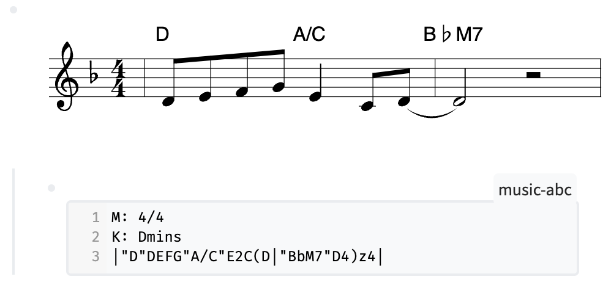

## Music Notation

Renders Music in Logseq using ABC Notation

### Demo

##### Logseq.App

- `registerSlashCommand: (tag: string, action: BlockCommandCallback | Array<SlashCommandAction>) => boolean`
- `onMacroRendererSlotted: IUserSlotHook<{ payload: { arguments: Array<string>, uuid: string, [key: string]: any } }>`

### Running the Sample

> 🏷 Minimal version of App [0.4.6](https://github.com/logseq/logseq/releases/tag/0.4.6) !

- `yarn && yarn build` in terminal to install dependencies.
- `Load unpacked plugin` in Logseq Desktop client.

### License

MIT
